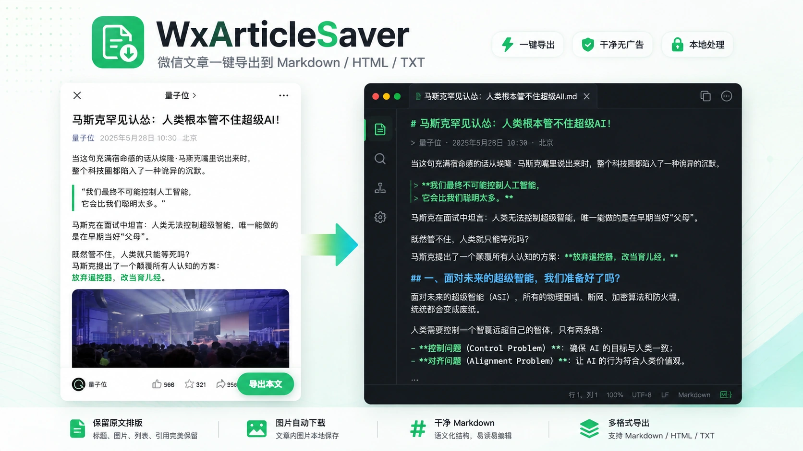
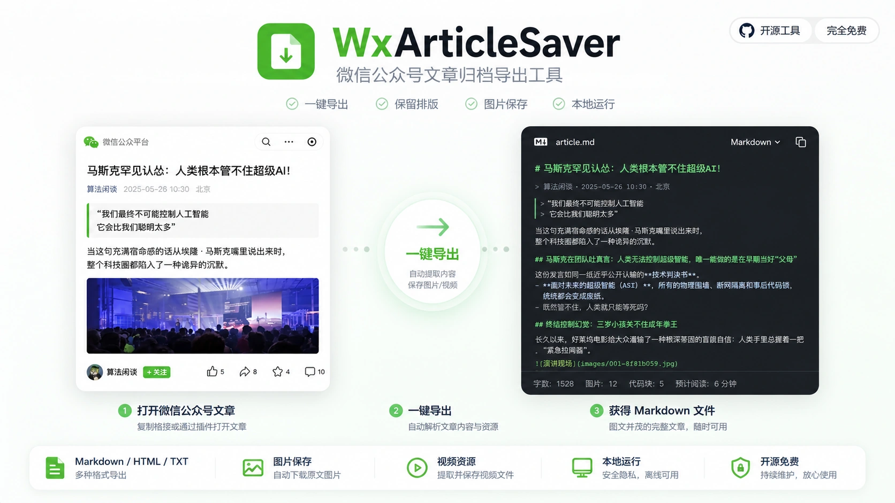

<p align="right">
  <a href="./README.md">中文</a> | <a href="./README_EN.md">English</a>
</p>

<h1 align="center">WxArticleSaver</h1>

<p align="center">
  本地运行的微信公众号文章归档工具。<br>
  打开你可以正常阅读的公众号文章，点击右下角「导出本文」，即可保存文章正文、图片及可直接获取的媒体资源。
</p>

<p align="center">
  <strong>Windows 10 / 11</strong> · <strong>GNU AGPL-3.0</strong>
</p>

<p align="center">
  
</p>

## 功能

- 📄 一键导出 Markdown / HTML / TXT
- 🖼️ 自动保存文章图片
- 🎬 支持文章内可直接获取的视频资源
- 🔒 所有文章内容默认仅保存在本机
- 🚫 不需要第三方账号或云服务

<p align="center">
  
</p>

## 快速开始

### 方式一：免安装便携版（推荐 · 无需安装 Python）

1. 前往 **[Releases 最新发布页](https://github.com/shanliuling/WxArticleSaver/releases/latest)** 下载最新的 `WxArticleSaver-*-Windows-x64.zip`。
2. 解压到任意文件夹，双击运行 **`WxArticleSaver.exe`**。

---

### 方式二：源码运行（适合开发者）

#### 1. 环境要求
- Windows 10 / 11
- Python 3.11 或 3.12

#### 2. 启动
下载源码后双击：

```text
install_and_run.bat
```

首次运行会自动安装 Python 依赖，并在**当前 Windows 用户**下临时信任本机生成的代理证书。

---

### 3. 导出文章（通用步骤）

1. 启动 WxArticleSaver 后，完全退出微信并重新打开。
2. 打开你可以正常阅读的公众号文章。
3. 点击文章右下角 **「导出本文」**。
4. 如果没有看到按钮，请按 **Ctrl+R**，或在文章页面内 **右键 → 刷新** 后重试。
5. 如果文章包含视频，建议先播放几秒，再点击「导出本文」。

导出内容默认保存在：

```text
exports/
└─ 文章标题/
   ├─ article.md
   ├─ article.html
   ├─ article.txt
   ├─ raw_wechat_response.html
   ├─ meta.json
   ├─ images/
   └─ videos/
```

## 为什么有时需要刷新？

Windows 微信可能直接从 WebView 页面缓存恢复已经打开过的文章，此时不会重新请求文章主 HTML，WxArticleSaver 就没有机会注入导出按钮。

程序会在能够确认前台窗口是微信时，**尽力自动发送一次 Ctrl+R**。如果自动刷新没有触发，手动按 Ctrl+R 或右键刷新即可。

## 视频说明

微信文章中的视频通常不会直接把真实媒体地址写在初始 HTML 里，因此建议先播放几秒，让页面实际请求媒体资源，再执行导出。

## 安全设计

WxArticleSaver 使用本地 `mitmproxy` 读取并修改微信文章 HTTPS 响应，因此首次运行需要在当前用户证书库中临时信任一个**由本机生成**的 CA。

## 常见问题

### 没有出现「导出本文」怎么办？

先在当前文章页按 **Ctrl+R**，或 **右键 → 刷新**。这是目前最常见的情况，通常由微信 WebView 页面缓存导致。

### 退出后网络不正常怎么办？

运行：

```text
restore_proxy.bat
```

### 想移除工具安装过的根证书怎么办？

运行：

```text
remove_certificate.bat
```

## 使用说明与免责声明

本项目用于对用户**合法有权访问的内容**进行个人离线归档、学习与研究。

请勿将本项目用于绕过付费、访问权限、DRM 或其他技术保护措施，也请勿用于未经授权的批量采集、版权内容再分发或其他侵害第三方权益的用途。使用者应自行遵守所在地适用法律法规及相关平台规则。

本项目按现状提供，不对因使用本项目产生的账号、数据、网络配置或其他损失作任何保证。若你不了解 HTTPS 本地代理和根证书的含义，请先阅读上方「安全设计」后再运行。

## License

本项目采用 **GNU Affero General Public License v3.0 (AGPL-3.0)** 开源。

如果你修改本项目并以符合 AGPL 第 13 条的方式通过网络向用户提供其功能，应按 AGPL 的要求向这些用户提供相应源代码。完整条款见 [`LICENSE`](./LICENSE)。
